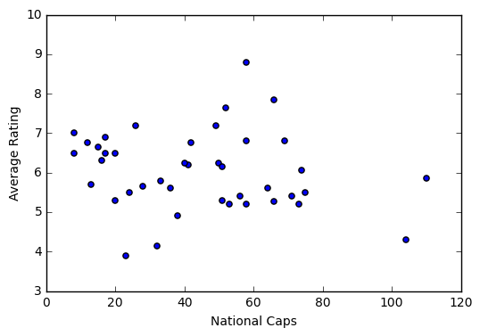
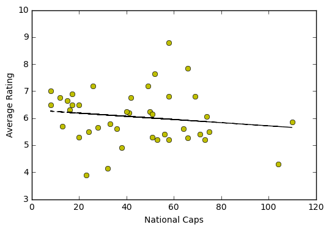

### [Code Repo](https://github.com/LEO-E-100/Lions_Tour_Ratings)

Data has been taken from the crowd sourced player ratings from each of the games for the British and Irish Lions. Each player in the squad is rated for their performance (assuming they played) after each match.

Currently data is not yet full as not all matches have been played. However the analysis can be put in place now.


```python
# Import statements and creating the dataframe to be used.

import pandas as pd
import numpy as np
import matplotlib
import matplotlib.pyplot as plt
from scipy.stats import linregress
%matplotlib inline

df = pd.read_csv('r_rugbyunion_player_ratings.csv')
df.fillna(0, inplace=True)
df['Index'] = df.index
df.head()
```


<div>
<style>
    .dataframe thead tr:only-child th {
        text-align: right;
    }

    .dataframe thead th {
        text-align: left;
    }

    .dataframe tbody tr th {
        vertical-align: top;
    }
</style>
<table border="1" class="dataframe">
  <thead>
    <tr style="text-align: right;">
      <th></th>
      <th>Name</th>
      <th>Position</th>
      <th>Home _Nation</th>
      <th>Home_Club</th>
      <th>National_Caps</th>
      <th>Lions_Caps</th>
      <th>NZ_Barbarians</th>
      <th>Blues</th>
      <th>Crusaders</th>
      <th>Highlanders</th>
      <th>Maori_All_Blacks</th>
      <th>Chiefs</th>
      <th>All_Blacks_1</th>
      <th>Hurricanes</th>
      <th>All_Blacks_2</th>
      <th>All_Blacks_3</th>
      <th>All_Blacks_Avg</th>
      <th>Index</th>
    </tr>
  </thead>
  <tbody>
    <tr>
      <th>0</th>
      <td>Rory Best</td>
      <td>Hooker</td>
      <td>Ireland</td>
      <td>Ulster</td>
      <td>104</td>
      <td>0</td>
      <td>5.3</td>
      <td>3.3</td>
      <td>0.0</td>
      <td>0.0</td>
      <td>0.0</td>
      <td>0.0</td>
      <td>0.0</td>
      <td>0.0</td>
      <td>0.0</td>
      <td>0.0</td>
      <td>0.0</td>
      <td>0</td>
    </tr>
    <tr>
      <th>1</th>
      <td>Jamie George</td>
      <td>Hooker</td>
      <td>England</td>
      <td>Saracens</td>
      <td>17</td>
      <td>0</td>
      <td>5.7</td>
      <td>0.0</td>
      <td>7.3</td>
      <td>0.0</td>
      <td>0.0</td>
      <td>0.0</td>
      <td>0.0</td>
      <td>0.0</td>
      <td>0.0</td>
      <td>0.0</td>
      <td>0.0</td>
      <td>1</td>
    </tr>
    <tr>
      <th>2</th>
      <td>Ken Owens</td>
      <td>Hooker</td>
      <td>Wales</td>
      <td>Scarlets</td>
      <td>50</td>
      <td>0</td>
      <td>0.0</td>
      <td>6.5</td>
      <td>6.0</td>
      <td>0.0</td>
      <td>0.0</td>
      <td>0.0</td>
      <td>0.0</td>
      <td>0.0</td>
      <td>0.0</td>
      <td>0.0</td>
      <td>0.0</td>
      <td>2</td>
    </tr>
    <tr>
      <th>3</th>
      <td>Dan Cole</td>
      <td>Prop</td>
      <td>England</td>
      <td>Leicester</td>
      <td>74</td>
      <td>3</td>
      <td>0.0</td>
      <td>6.1</td>
      <td>6.0</td>
      <td>0.0</td>
      <td>0.0</td>
      <td>0.0</td>
      <td>0.0</td>
      <td>0.0</td>
      <td>0.0</td>
      <td>0.0</td>
      <td>0.0</td>
      <td>3</td>
    </tr>
    <tr>
      <th>4</th>
      <td>Tadhg Furlong</td>
      <td>Prop</td>
      <td>Ireland</td>
      <td>Leinster</td>
      <td>16</td>
      <td>0</td>
      <td>5.6</td>
      <td>0.0</td>
      <td>7.0</td>
      <td>0.0</td>
      <td>0.0</td>
      <td>0.0</td>
      <td>0.0</td>
      <td>0.0</td>
      <td>0.0</td>
      <td>0.0</td>
      <td>0.0</td>
      <td>4</td>
    </tr>
  </tbody>
</table>
</div>


```python
# Add a feature column of overall rating which will simply sum the values in the game columns
df['Total_Rating'] = (df['NZ_Barbarians'] + df['Blues'] + df['Crusaders'] + df['Highlanders'] + df['Maori_All_Blacks'] + df['Chiefs'] + df['All_Blacks_1'] + df ['Hurricanes'] + df['All_Blacks_2'] + df['All_Blacks_3'])
# Creating a list of game columns will be useful for iteration later
games = ['NZ_Barbarians', 'Blues', 'Crusaders', 'Highlanders', 'Maori_All_Blacks', 'Chiefs', 'All_Blacks_1', 'Hurricanes', 'All_Blacks_2', 'All_Blacks_3']
# This dataframe may or may not be used but it represents a sub table of all player ratings without names etc.
df1 = pd.DataFrame(df, columns=games)
df1.head()
```


<div>
<style>
    .dataframe thead tr:only-child th {
        text-align: right;
    }

    .dataframe thead th {
        text-align: left;
    }

    .dataframe tbody tr th {
        vertical-align: top;
    }
</style>
<table border="1" class="dataframe">
  <thead>
    <tr style="text-align: right;">
      <th></th>
      <th>NZ_Barbarians</th>
      <th>Blues</th>
      <th>Crusaders</th>
      <th>Highlanders</th>
      <th>Maori_All_Blacks</th>
      <th>Chiefs</th>
      <th>All_Blacks_1</th>
      <th>Hurricanes</th>
      <th>All_Blacks_2</th>
      <th>All_Blacks_3</th>
    </tr>
  </thead>
  <tbody>
    <tr>
      <th>0</th>
      <td>5.3</td>
      <td>3.3</td>
      <td>0.0</td>
      <td>0.0</td>
      <td>0.0</td>
      <td>0.0</td>
      <td>0.0</td>
      <td>0.0</td>
      <td>0.0</td>
      <td>0.0</td>
    </tr>
    <tr>
      <th>1</th>
      <td>5.7</td>
      <td>0.0</td>
      <td>7.3</td>
      <td>0.0</td>
      <td>0.0</td>
      <td>0.0</td>
      <td>0.0</td>
      <td>0.0</td>
      <td>0.0</td>
      <td>0.0</td>
    </tr>
    <tr>
      <th>2</th>
      <td>0.0</td>
      <td>6.5</td>
      <td>6.0</td>
      <td>0.0</td>
      <td>0.0</td>
      <td>0.0</td>
      <td>0.0</td>
      <td>0.0</td>
      <td>0.0</td>
      <td>0.0</td>
    </tr>
    <tr>
      <th>3</th>
      <td>0.0</td>
      <td>6.1</td>
      <td>6.0</td>
      <td>0.0</td>
      <td>0.0</td>
      <td>0.0</td>
      <td>0.0</td>
      <td>0.0</td>
      <td>0.0</td>
      <td>0.0</td>
    </tr>
    <tr>
      <th>4</th>
      <td>5.6</td>
      <td>0.0</td>
      <td>7.0</td>
      <td>0.0</td>
      <td>0.0</td>
      <td>0.0</td>
      <td>0.0</td>
      <td>0.0</td>
      <td>0.0</td>
      <td>0.0</td>
    </tr>
  </tbody>
</table>
</div>


## So Far:

So far a dataset has been created as a CSV and loaded into the notebook. Then some features of the data have been added to give better explanatory power. These are a 'Total rating' column which will add the ratings from each of the ten games as well as an average column which will calculate the mean rating.

A possible idea might be to engineer it so that zero values are ignored from the list as no player will play in every game and thus their rating will be skewed. This may appear as a systematic error but it is unlikely that each player will play exactly the same number of games and players who play less will experience a greater disadvantage in ratings.

Maybe:
- Create a column of 'games played'
- When calculating average divide by this column value rather than constant of 10.

It must be noted at this stage that the values will be updated as the matches go on.


```python
# A total games played column will count the number of non-zero player ratings for each player and store in a new column.
df['Games_Played'] = 0

for i in df['Index']:
    for j in games:
        if df[j][i] != 0.0:
            df['Games_Played'][i] += 1
        else:
            continue
df.head()
```

    /Applications/anaconda/lib/python2.7/site-packages/ipykernel/__main__.py:7: SettingWithCopyWarning:
    A value is trying to be set on a copy of a slice from a DataFrame

    See the caveats in the documentation: http://pandas.pydata.org/pandas-docs/stable/indexing.html#indexing-view-versus-copy


<div>
<style>
    .dataframe thead tr:only-child th {
        text-align: right;
    }

    .dataframe thead th {
        text-align: left;
    }

    .dataframe tbody tr th {
        vertical-align: top;
    }
</style>
<table border="1" class="dataframe">
  <thead>
    <tr style="text-align: right;">
      <th></th>
      <th>Name</th>
      <th>Position</th>
      <th>Home _Nation</th>
      <th>Home_Club</th>
      <th>National_Caps</th>
      <th>Lions_Caps</th>
      <th>NZ_Barbarians</th>
      <th>Blues</th>
      <th>Crusaders</th>
      <th>Highlanders</th>
      <th>Maori_All_Blacks</th>
      <th>Chiefs</th>
      <th>All_Blacks_1</th>
      <th>Hurricanes</th>
      <th>All_Blacks_2</th>
      <th>All_Blacks_3</th>
      <th>All_Blacks_Avg</th>
      <th>Index</th>
      <th>Total_Rating</th>
      <th>Games_Played</th>
    </tr>
  </thead>
  <tbody>
    <tr>
      <th>0</th>
      <td>Rory Best</td>
      <td>Hooker</td>
      <td>Ireland</td>
      <td>Ulster</td>
      <td>104</td>
      <td>0</td>
      <td>5.3</td>
      <td>3.3</td>
      <td>0.0</td>
      <td>0.0</td>
      <td>0.0</td>
      <td>0.0</td>
      <td>0.0</td>
      <td>0.0</td>
      <td>0.0</td>
      <td>0.0</td>
      <td>0.0</td>
      <td>0</td>
      <td>8.6</td>
      <td>2</td>
    </tr>
    <tr>
      <th>1</th>
      <td>Jamie George</td>
      <td>Hooker</td>
      <td>England</td>
      <td>Saracens</td>
      <td>17</td>
      <td>0</td>
      <td>5.7</td>
      <td>0.0</td>
      <td>7.3</td>
      <td>0.0</td>
      <td>0.0</td>
      <td>0.0</td>
      <td>0.0</td>
      <td>0.0</td>
      <td>0.0</td>
      <td>0.0</td>
      <td>0.0</td>
      <td>1</td>
      <td>13.0</td>
      <td>2</td>
    </tr>
    <tr>
      <th>2</th>
      <td>Ken Owens</td>
      <td>Hooker</td>
      <td>Wales</td>
      <td>Scarlets</td>
      <td>50</td>
      <td>0</td>
      <td>0.0</td>
      <td>6.5</td>
      <td>6.0</td>
      <td>0.0</td>
      <td>0.0</td>
      <td>0.0</td>
      <td>0.0</td>
      <td>0.0</td>
      <td>0.0</td>
      <td>0.0</td>
      <td>0.0</td>
      <td>2</td>
      <td>12.5</td>
      <td>2</td>
    </tr>
    <tr>
      <th>3</th>
      <td>Dan Cole</td>
      <td>Prop</td>
      <td>England</td>
      <td>Leicester</td>
      <td>74</td>
      <td>3</td>
      <td>0.0</td>
      <td>6.1</td>
      <td>6.0</td>
      <td>0.0</td>
      <td>0.0</td>
      <td>0.0</td>
      <td>0.0</td>
      <td>0.0</td>
      <td>0.0</td>
      <td>0.0</td>
      <td>0.0</td>
      <td>3</td>
      <td>12.1</td>
      <td>2</td>
    </tr>
    <tr>
      <th>4</th>
      <td>Tadhg Furlong</td>
      <td>Prop</td>
      <td>Ireland</td>
      <td>Leinster</td>
      <td>16</td>
      <td>0</td>
      <td>5.6</td>
      <td>0.0</td>
      <td>7.0</td>
      <td>0.0</td>
      <td>0.0</td>
      <td>0.0</td>
      <td>0.0</td>
      <td>0.0</td>
      <td>0.0</td>
      <td>0.0</td>
      <td>0.0</td>
      <td>4</td>
      <td>12.6</td>
      <td>2</td>
    </tr>
  </tbody>
</table>
</div>


```python
# Calculating a proper average of player rating per game played
df['Player_Average'] = (df['Total_Rating'])/(df['Games_Played'])
```


## Some Graphs

Now we have our data in a usable format and some feature columns created we can look at some interesting analysis.

Obviously with fairly limited data at the current time it is hard to find trends, however a plot of caps vs average rating could be interesting. A linear model will be used to find if a trend actually exists.

The more interesting analysis will be in how the players have improved across the tour and this will be possible after more data become available.


```python
X = df['National_Caps']
Y = df['Player_Average']
plt.scatter(X, Y)
plt.xlabel ('National Caps')
plt.ylabel ('Average Rating')
plt.show()
```





```python
# A linear model of caps vs. average rating

fit = np.polyfit(X,Y,1)
fit_fn = np.poly1d(fit)
# fit_fn is now a function which takes in x and returns an estimate for y

plt.plot(X,Y, 'yo', X, fit_fn(X), '--k')
plt.xlim(0, 120)
plt.ylim(3, 10)
plt.xlabel ('National Caps')
plt.ylabel ('Average Rating')
plt.show()
```





```python
linregress(X,Y)
```


    (-0.0058865854791020928,
     6.3039656702974431,
     -0.14794320019714155,
     0.35595680254115158,
     0.0063013066628018304)


### Linregress Output

The output of a linregress function call is a list of 5 values.
1. Slope
2. Intercept
3. R-value
4. P-value
5. Standard Error

So it can be seen that the number of caps has very little relevance to the average player rating and no correlation is a fair assumption.

A facile interpretation however suggests that a player with no caps would have an average rating of 6.3 so far this tour.


```python
from IPython.display import HTML
HTML('''<script>
code_show_err=false;
function code_toggle_err() {
 if (code_show_err){
 $('div.output_stderr').hide();
 } else {
 $('div.output_stderr').show();
 }
 code_show_err = !code_show_err
}
$( document ).ready(code_toggle_err);
</script>
To toggle on/off output_stderr, click <a href="javascript:code_toggle_err()">here</a>.''')
```


<script>
code_show_err=false;
function code_toggle_err() {
 if (code_show_err){
 $('div.output_stderr').hide();
 } else {
 $('div.output_stderr').show();
 }
 code_show_err = !code_show_err
}
$( document ).ready(code_toggle_err);
</script>
To toggle on/off output_stderr, click <a href="javascript:code_toggle_err()">here</a>.


```python

```
