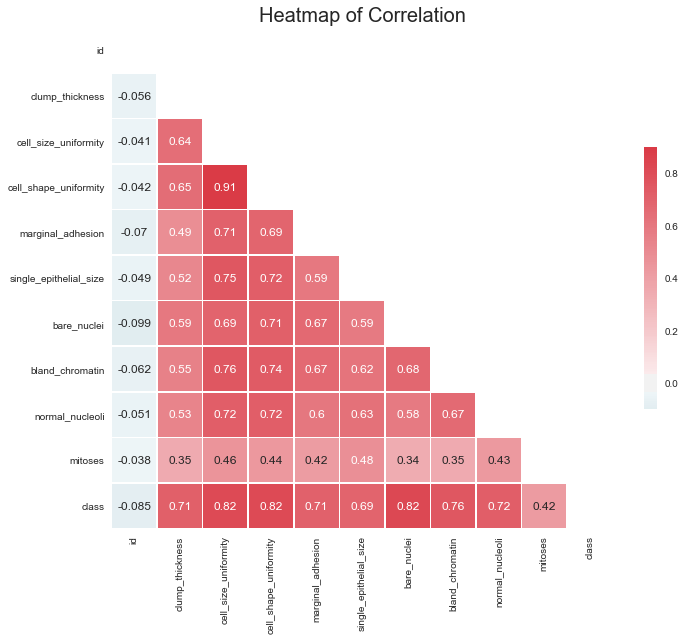
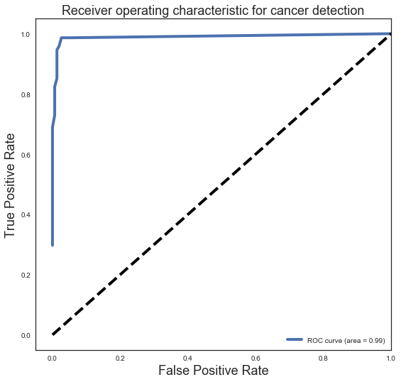

### {{ page.title}}

```python
import numpy as np
import pandas as pd
import seaborn as sns
import matplotlib.pyplot as plt

from sklearn.metrics import classification_report
from sklearn.metrics import confusion_matrix
from sklearn.neighbors import KNeighborsClassifier
from sklearn.model_selection import train_test_split
from sklearn.metrics import roc_curve, auc
```


```python
np.set_printoptions(precision=4)

plt.style.use('fivethirtyeight')

column_names = ['id',
                'clump_thickness',
                'cell_size_uniformity',
                'cell_shape_uniformity',
                'marginal_adhesion',
                'single_epithelial_size',
                'bare_nuclei',
                'bland_chromatin',
                'normal_nucleoli',
                'mitoses',
                'class']
```


```python
bcw = pd.read_csv('https://archive.ics.uci.edu/ml/machine-learning-databases/breast-cancer-wisconsin/breast-cancer-wisconsin.data',
                  names=column_names)

bcw['bare_nuclei'] = bcw.bare_nuclei.map(lambda x: int(x) if not x == '?' else np.nan)
bcw.dropna(inplace=True)
```


```python
correlation_matrix = bcw.corr()

```


```python
sns.set(style="white")
# Generate a mask for the upper triangle
mask = np.zeros_like(correlation_matrix, dtype=np.bool)
mask[np.triu_indices_from(mask)] = True
# Set up the matplotlib figure
f, ax = plt.subplots(figsize=(10, 9))
# Generate a custom diverging colormap
cmap = sns.diverging_palette(220, 10, as_cmap=True)
# Draw the heatmap with the mask and correct aspect ratio
sns.heatmap(correlation_matrix, mask=mask, cmap=cmap, vmax=.9, center=0,
            square=True, linewidths=.5, cbar_kws={"shrink": .5}, annot=True)
plt.title('Heatmap of Correlation', size=20)
plt.savefig('Correlation_Heatmap.png')
plt.show()
```





```python
y = bcw['class'].map(lambda x: 1 if x == 4 else 0)
X = bcw.iloc[:, 1:-1]
```


```python
X_train, X_test, y_train, y_test = train_test_split(X, y, test_size=0.33)
knn = KNeighborsClassifier(n_neighbors=25)
knn.fit(X_train, y_train)
```


    KNeighborsClassifier(algorithm='auto', leaf_size=30, metric='minkowski',
               metric_params=None, n_jobs=1, n_neighbors=25, p=2,
               weights='uniform')


```python
print 'Baseline:\t', 1. - np.mean(y_test)
print '\n'
print 'Model score:\t', knn.score(X_test, y_test)
print '\n'
```

    Baseline:	0.672566371681


    Model score:	0.964601769912


```python
# predicted test class:
y_pred = knn.predict(X_test)

# predicted test probability:
y_pp = knn.predict_proba(X_test)

# Let's say again that we are predicting cancer based on some kind of detection measure, as before.
# Accuracy Score
conmat = np.array(confusion_matrix(y_test, y_pred, labels=[1,0]))
classification_report = classification_report(y_test, y_pred)
print '\n'
print classification_report

confusion = pd.DataFrame(conmat, index=['is_cancer', 'is_healthy'],
                         columns=['predicted_cancer','predicted_healthy'])
print "50/50 Thresholds: \n", confusion
print '\n'
# Get the predicted probability vector and explicitly name the columns:
Y_pp = pd.DataFrame(knn.predict_proba(X_test), columns=['class_0_pp','class_1_pp'])
Y_pp.head(10)

Y_pp['pred_class_thresh10'] = [1 if x >= 0.10 else 0 for x in Y_pp.class_1_pp.values]
Y_pp.head(20)

conmat = np.array(confusion_matrix(y_test, Y_pp.pred_class_thresh10.values, labels=[1,0]))

confusion = pd.DataFrame(conmat, index=['is_cancer', 'is_healthy'],
                         columns=['predicted_cancer','predicted_healthy'])
print "Changed Thresholds: \n", confusion
print '\n'
```


                 precision    recall  f1-score   support

              0       0.96      0.99      0.97       152
              1       0.97      0.92      0.94        74

    avg / total       0.96      0.96      0.96       226

    50/50 Thresholds:
                predicted_cancer  predicted_healthy
    is_cancer                 68                  6
    is_healthy                 2                150


    Changed Thresholds:
                predicted_cancer  predicted_healthy
    is_cancer                 73                  1
    is_healthy                 6                146


```python
# For class 1, find the area under the curve
fpr, tpr, threshold = roc_curve(y_test, Y_pp.class_1_pp)
roc_auc = auc(fpr, tpr)

# Plot of a ROC curve for class 1 (has_cancer)
plt.figure(figsize=[8,8])
plt.plot(fpr, tpr, label='ROC curve (area = %0.2f)' % roc_auc, linewidth=4)
plt.plot([0, 1], [0, 1], 'k--', linewidth=4)
plt.xlim([-0.05, 1.0])
plt.ylim([-0.05, 1.05])
plt.xlabel('False Positive Rate', fontsize=18)
plt.ylabel('True Positive Rate', fontsize=18)
plt.title('Receiver operating characteristic for cancer detection', fontsize=18)
plt.legend(loc="lower right")
plt.savefig('ROC_plot.png')
plt.show()

print '\n'
print 'fpr\t', 'tpr\t', 'threshold'
print np.array(zip(fpr,tpr,threshold))
```





    fpr	tpr	threshold
    [[ 0.      0.2973  1.    ]
     [ 0.      0.5676  0.96  ]
     [ 0.      0.6892  0.92  ]
     [ 0.0066  0.7297  0.88  ]
     [ 0.0066  0.8108  0.84  ]
     [ 0.0066  0.8243  0.8   ]
     [ 0.0132  0.8514  0.72  ]
     [ 0.0132  0.8784  0.68  ]
     [ 0.0132  0.9189  0.52  ]
     [ 0.0132  0.9459  0.48  ]
     [ 0.0197  0.9595  0.44  ]
     [ 0.0263  0.9865  0.36  ]
     [ 0.0395  0.9865  0.2   ]
     [ 0.0526  0.9865  0.04  ]
     [ 1.      1.      0.    ]]
